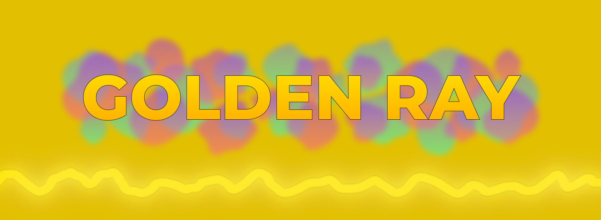
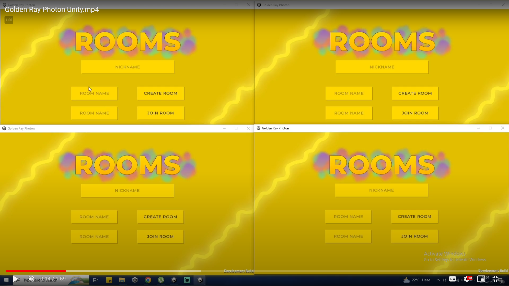
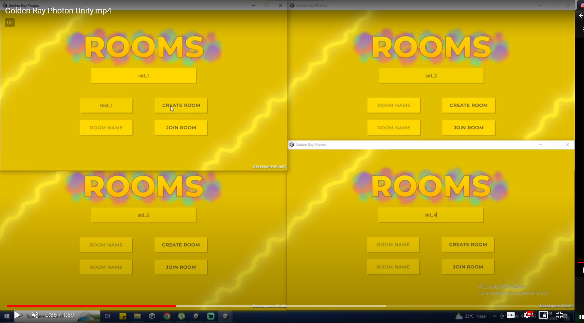
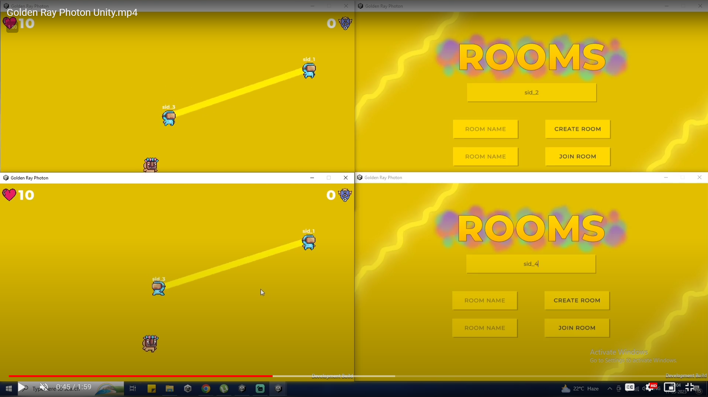
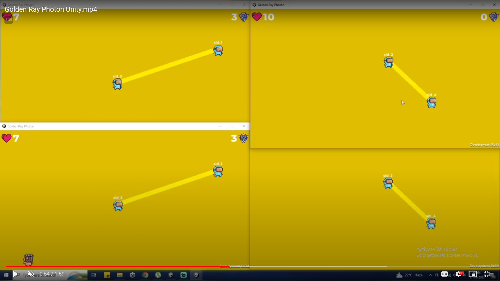
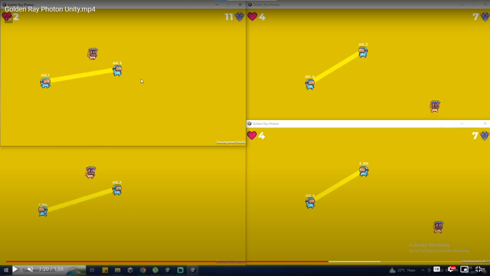
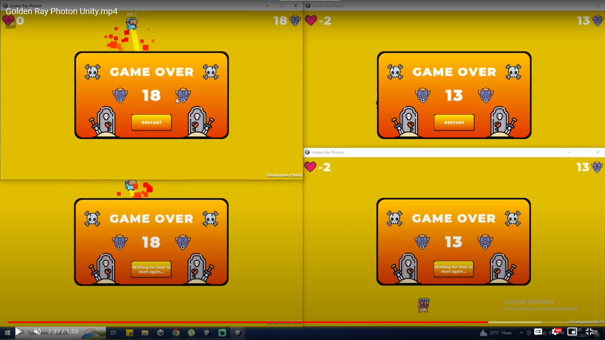

# Golden Ray Photon Multiplayer Unity

### Simple Unity Multiplaye Game

Hey folks,

This is first time I have tried muliplayer game in Unity Game engine using Photon Networking for multiplayer services. 
The entire game was made following simple tutorial series provided by a youtuber 'BlackThronProd' in their udemy course. 
<ins>Here is the link to the course:</ins> 

**https://www.udemy.com/course/beginners-guide-to-multiplayer-game-development-in-unity/** 

As for the assets I have downloaded all the art, sprite and UI related things and other things from the Unity Asset Store, Figma and Flaticons. 

<ins>Also if you want to see the working demo video for this then go to this link:</ins> 
**https://drive.google.com/file/d/1-BI-WrYM3ThcL7sJ1aDpFRdx7IZd4xdu/view?usp=sharing** 

### Here are few in game screenshot

